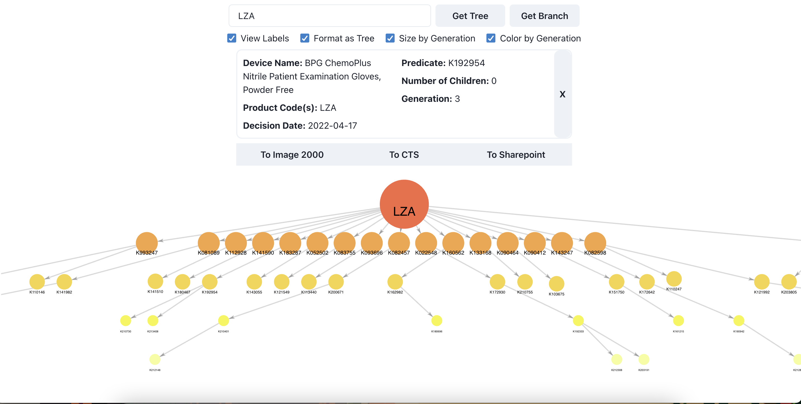
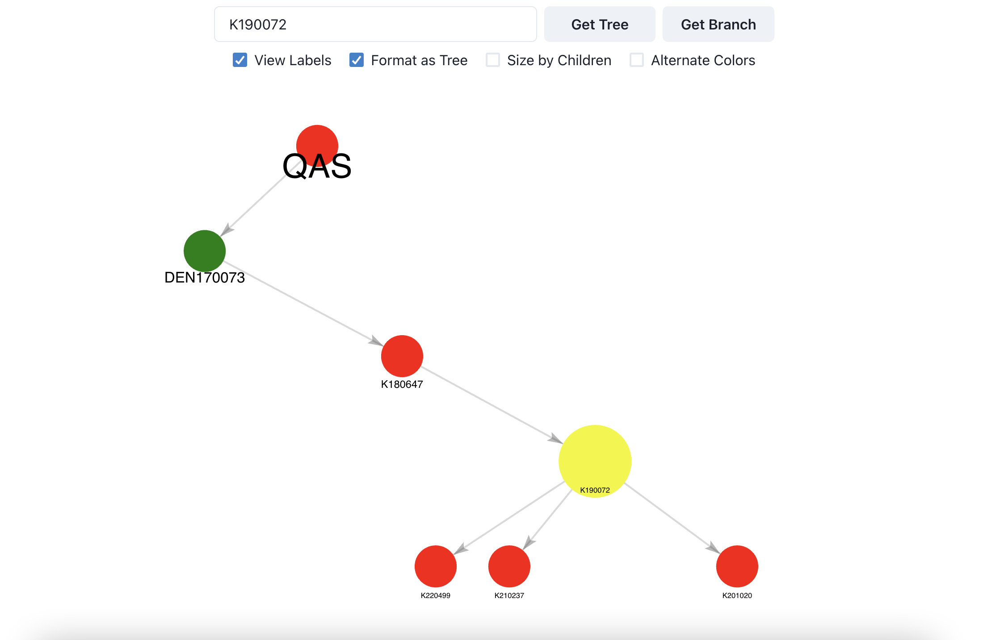

# Predicate Trees

### Query product codes and document numbers to visualize predicate device relationships.

## How to Run
- Clone this repository
- To run the webpage locally, navigate to ```./src/front```, then run ```npm i``` followed by ```npm start```. This will launch the webpage on localhost:3000.
- To test the webscraping and (experimental) flask endpoints, first run ```pip install -r requirements.txt``` in the root directory
  - All of the scraping functionality can be found in ```./notebooks/closestK.ipynb```. **The main functions you care about are scrape_tree and scrape_branch.** Documentation is self-contained. 
  - To run a development server for the flask backend, navigate to ```./src/back``` and run ```python -m flask run```
  
## General Usage
### Get Tree:
  - If user input is a product code, returns a visual for the entire tree
  - If user input is a document number, returns a visual for the corresponding product tree, highlighting the queried node
  
### Get Branch:
  - User input **must** be a document number, returns a tree will all direct predicates and descendents of the queried node
  
### User Options:
  - **View Labels**: Enable labels indicating document number for each node
  - **Format as Tree**: Visualize graph as a top-down DAG
  - **Size by Generation/Size by Children**: Vary node size based off number of predicates vs. vary node size based off number of direct children
  - **Alternate Colors/Color by Generation**: Alternate colors between generations vs. color as a gradient from origin
  
  
### Tooltip:
  - **Device Name, Product Code(s), Decision Date**: Pulled from openFDA API
  - **Predicate**: Direct predicate for corresponding selected node
  - **Number of Children**: Count of directly adjacent descendents
  - **Generation**: Proximity from "origin" device

## Images



